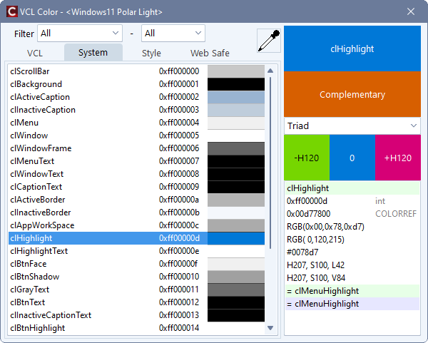

# VclColor

This lists the color constants for VCL (Visual Component Library).  
The list can be filtered by some criteria.  
Typical color schemes can be referenced.  

## Option

The font of list box can be selected from the right-click menu.  

## Development Environment

C++Builder 11.3 (BCC32C)
